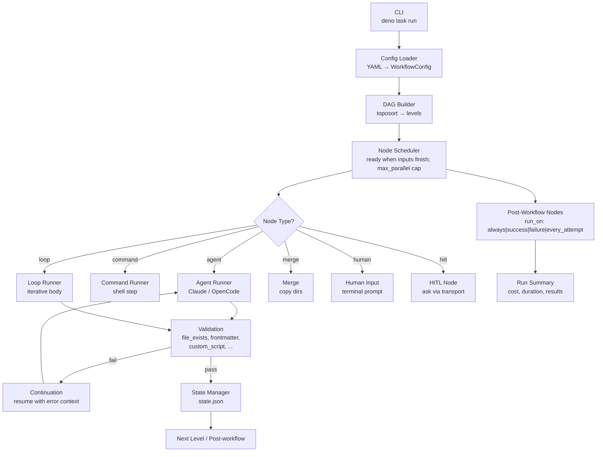
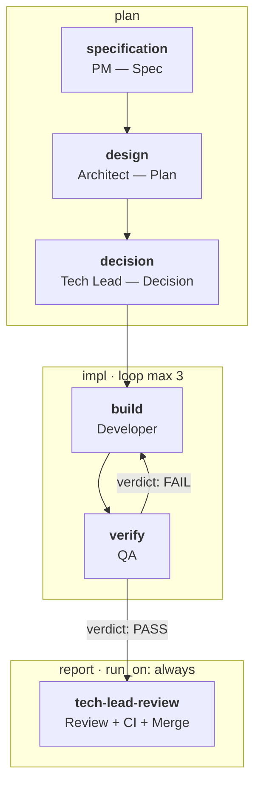

# flowai-workflow

Universal DAG-based engine for orchestrating AI agents. Define agent workflows as YAML configs — the engine handles execution, inter-agent communication, validation, loops, resume, and runtime selection.

## Install

`flowai-workflow` ships as a Claude Code / Codex plugin. The plugin's
`.mcp.json` invokes the `flowai-workflow mcp` subcommand directly —
the engine binary is a **plugin precondition** (FR-E78).

### Prerequisite — install the engine binary on PATH

Pick one of:

- **Release binary (recommended for end users).** Download the binary
  for your platform from
  [GitHub Releases](https://github.com/korchasa/flowai-workflow/releases/latest)
  (`flowai-workflow-{linux,darwin,windows}-{x86_64,arm64}[.exe]`),
  verify the accompanying `<artifact>.sha256` sidecar with
  `sha256sum -c`, then `chmod +x` and move into a directory on
  `$PATH` (`/usr/local/bin/` is typical on POSIX).
- **JSR install (recommended for Deno users).**
  `deno install -A -n flowai-workflow jsr:@korchasa/flowai-workflow/cli`.
  Deno 2.x is the only prerequisite.

Verify with `flowai-workflow --version`. The ARM-64 Linux binary is
cross-compiled and not currently exercised in CI runtime tests — if
you hit a runtime issue on `aarch64`, prefer the JSR install or
rebuild from source.

### Claude Code

```
/plugin marketplace add korchasa/flowai-workflow-plugins --sparse claude
/plugin install flowai-workflow@korchasa
```

Then invoke the skills from inside Claude Code:

- `/flowai-workflow:run <workflow-name>` — execute a bundled or
  project-local DAG (forwards `--prompt`, `--dry-run`, `--cycles`,
  `-v`/`-s`/`-q`, etc.).
- `/flowai-workflow:init` — scaffold a bundled workflow into the
  current project under `.flowai-workflow/<name>/`. Combine with
  `--list` to enumerate the bundled workflows first.

### Codex

```
codex plugin marketplace add korchasa/flowai-workflow-plugins --sparse codex
codex plugin add flowai-workflow@flowai-workflow
```

No `~/.codex/config.toml` `[mcp_servers.*]` block is required. The
Codex payload ships host-native plugin metadata plus an embedded MCP
config (`command = "flowai-workflow", args = ["mcp"]`), so plugin
install wires both interactive skills and the MCP server.

### Troubleshooting — missing binary

If the MCP host surfaces `ENOENT: no such file or directory:
flowai-workflow`, the precondition is unmet — go back to the
prerequisite section above and install the binary. The plugin does
not download or compile the engine itself; it relies on the binary
being on `$PATH` at handshake time.

### Plugin CI smoke guarantee

Release CI runs `plugin-payload-smoke` plus the publish-shape install
smoke against isolated Claude Code and Codex homes. It verifies the
generated split payload roots, installs `flowai-workflow@flowai-workflow`,
then performs an automated MCP handshake (`initialize` and `tools/list`)
from the installed cache. Hook definitions are parsed and command hooks
are executed with synthetic host environment variables when bundled.
Codex hook trust remains a user-reviewed step; CI validates hook payload
shape and executability, not automatic trust in a real Codex session.

### Migrating from the FR-E74 launcher

Earlier plugin builds shipped a Deno launcher (`bin/launch.ts`) that
lazy-compiled the engine on first call. As of FR-E78 the plugin
treats the `flowai-workflow` engine binary as a precondition: install
it once on PATH (see the prerequisite above), reinstall the plugin,
and the `.mcp.json` invokes `flowai-workflow mcp` directly. There is
no migration shim — the install step above is the migration step.

### Local plugin dogfood

Framework developers iterating on `flowai-workflow` can rebuild the
plugin payload from the local checkout and reinstall it into Claude
Code AND Codex at user scope with a single command:

```bash
deno task sync-plugins-local             # rebuild + reinstall both IDEs
deno task sync-plugins-local --no-build  # reuse the previous build
```

The local install registers the marketplace under the distinct name
`flowai-workflow-local` (the official release uses `flowai-workflow`),
so `claude plugin list` and Codex `config.toml` clearly separate
dev-loop installs (`<plugin>@flowai-workflow-local`) from the official
release (`<plugin>@flowai-workflow`). Both can coexist; the local one
is rebuilt on every sync.

The script captures `claude plugin list --json` BEFORE removing the
marketplace, so plugins previously toggled to `enabled = false` stay
disabled after reinstall. On Codex it runs `codex plugin add
flowai-workflow@flowai-workflow-local` after marketplace registration so
the payload cache exists and the plugin is actually installed, then
reconciles `~/.codex/config.toml`
`[plugins."<name>@flowai-workflow-local"]` tables while preserving prior
`enabled` flags; official-marketplace entries (`@flowai-workflow`) are
left untouched. Missing `claude` or `codex` CLIs (or Codex CLI older than
0.130, which lacks `plugin marketplace`) are reported and skipped —
never fatal.

To wire the rebuild + reinstall into the every-commit dev loop, opt in
with `AUTO_INSTALL_PLUGINS=true` in `.env` or the environment:
`deno task check` will then run `sync-plugins-local` at the end of the
pipeline. Only the literal string `true` enables the hook; `1` / `yes`
/ `True` are intentionally rejected.

## Engine Architecture



## Core Concepts

The engine (Deno/TypeScript modules at repo root) reads a YAML workflow config and builds a directed acyclic graph (DAG) of nodes. A node starts as soon as the nodes it depends on have finished; the topological levels remain the picture `--dry-run` prints, not the schedule.

Concurrency is available but opt-in via `defaults.max_parallel`, which caps how many nodes run at once and defaults to 1. It is not higher by default because every node of a run shares one git worktree, so two nodes editing the same file clobber each other. A node that needs a tree of its own asks for it with `isolation: worktree`, and a fork branch that declares `allowed_paths` gets one for the whole branch. Leak detection follows the execution scope: while more than one node is running, they share one guardrail bracket instead of a per-node one, since the snapshots are repository-wide and would otherwise blame the wrong node. The `allowed_paths` check works the same way — a node is checked against its own scope plus the run directory the engine itself writes into plus the scopes of everyone sharing its tree, so it is never failed for a file it did not write.

Six node types:

- **agent** — invokes the configured runtime (`claude` by default, `opencode` also supported)
- **command** — runs a shell command as a graph node, with the same artifacts, validation and template variables as an agent
- **merge** — combines outputs from multiple predecessor nodes
- **loop** — iterative body with an exit condition: an artifact field, or an `until` shell predicate
- **human** — terminal prompt for manual input
- **hitl** — asks a human through the workflow's HITL transport and waits; agent-initiated HITL is supported on both Claude and OpenCode runtimes

Any node may carry a `when:` shell predicate that gates it (and, transitively, everything downstream of it). `agent` and `command` nodes may open a branch with `fork:` — either one named branch, or one branch per item of a list an earlier node produced — and exactly one node per group carries `join:`, which runs after every branch has finished.

Inter-agent communication uses structured Markdown artifacts in `<runs-dir>/<run-id>/[<phase>/]<node-id>/`, linked via `{{input.<node-id>}}` template variables. On validation failure, the engine resumes the agent in the same session with error context (continuation mechanism).

## Features

- **YAML-driven DAG** — declarative workflow definition, no hardcoded stage order
- **Domain-agnostic** — engine contains no git/GitHub/SDLC logic; any workflow expressible as a DAG
- **Workflow-independent** — engine does not reference concrete node names or artifact filenames; one engine, many workflows
- **Multi-runtime agents** — runtime selectable per workflow or per node: `claude` (default) or `opencode`
- **Loop nodes** — iterative cycles with configurable exit conditions and max iterations
- **Shell steps** — `type: command` nodes put a build, test or fetch step in the graph without spending an agent call
- **Conditional branches** — `when:` gates a node on a shell predicate; nodes downstream of an untaken branch are skipped too
- **Fork/join** — `fork:` splits the flow into named branches (or one branch per item of a list an earlier node produced) and `join:` merges them; every branch gets its own artifact directory, and the join reads each branch's answer from a manifest
- **Per-node isolation** — `isolation: worktree` gives a node its own git worktree while artifacts stay shared; a branch that declares `allowed_paths` gets one tree for the whole branch
- **Tamper-evident journal** — every `journal.jsonl` record is hash-chained; `flowai-workflow verify <run-id>` reports the first divergence
- **HITL support** — human interaction nodes for manual decisions or approvals; agent-initiated HITL works on Claude and OpenCode
- **Validation** — rule-based checks per node (file_exists, file_not_empty, contains_section, custom_script, frontmatter_field)
- **Resume** — failed/interrupted runs resumable via `--resume <run-id>`; completed nodes skipped
- **Observability** — 4 verbosity levels (`-q` / default / `-s` / `-v`); status lines with timestamps; final summary

## Quick Start: New Project

Scaffold a workflow into an existing project:

```bash
cd your-project
flowai-workflow init                       # interactive picker
flowai-workflow init --workflow autonomous-sdlc   # non-interactive
```

With no `--workflow` and a TTY, init prints the bundled workflows and
prompts you to pick one (Enter accepts the default `github-inbox`).
Pass `--workflow <name>` for CI / scripted use; non-TTY stdin (pipes,
no terminal) silently uses the default.

`init` is a verbatim copy: it streams the bundled
`<package>/.flowai-workflow/<workflow>/` tree (the same one the engine
project itself dogfoods) into your project's
`.flowai-workflow/<workflow>/`. No placeholder substitution, no
autodetection — what you see in the source repo is what lands on disk.

Project-specific configuration (test commands, branch names, repo
conventions, code-style rules) is the agents' job at first run. As the
last step of `init`, the CLI prints a ready-to-paste
**adaptation prompt** wrapped between
`--- ADAPTATION PROMPT (start) ---` / `(end)` markers. Hand that prompt
to the workflow:

```bash
flowai-workflow run .flowai-workflow/github-inbox --prompt "$(cat <<'EOF'
<paste the printed prompt body>
EOF
)"
```

The agents then inspect your `deno.json` / `package.json` /
`Cargo.toml` / `go.mod` / `pyproject.toml`, your `AGENTS.md` and CI
configs, detect language/test/lint/branch/repo conventions, patch
`workflow.yaml` and `agents/agent-*.md` in place, and stop without
committing — leaving the diff for you to review.

### Workflow folder

Every workflow lives in its own self-contained directory:

```
.flowai-workflow/<name>/
    workflow.yaml                  # required
    agents/agent-*.md              # required iff workflow.yaml references agent files
    memory/                        # optional; agent-*.md gitignored (runtime state)
    scripts/                       # optional
    runs/<run-id>/                 # generated, gitignored
        state.json                 # run state (persists across resume)
        <node-id>/...              # per-node artifact dirs
        worktree/                  # FR-E57: per-run git worktree
```

Multiple workflows in one project: keep them as siblings under
`.flowai-workflow/`; each is fully isolated. `git mv` a folder to share
it with another repo — it carries everything it needs.

### Init flags

```
flowai-workflow init [--workflow <name>] [--dry-run] [--allow-dirty]
```

- `--workflow <name>` — workflow folder under `<package>/.flowai-workflow/`
  (default: `github-inbox`). Omit for the interactive picker on a TTY;
  pipe stdin or pass explicitly in CI to skip the prompt.
- `-l`, `--list` — enumerate every workflow this build ships, exit 0.
  The set is identical for the JSR install, the standalone binary, and
  a local `deno run`; the binary embeds them via `deno compile
  --include` so installs without a network can still scaffold.
- `--dry-run` — print the files that would be written, exit 0.
- `--allow-dirty` — skip the clean-git-tree preflight check.

### Preflight

Init verifies before writing any file:

- `cwd` is inside a git worktree.
- The target `.flowai-workflow/<workflow>/` directory does not already
  exist.
- (Unless `--allow-dirty`) the working tree is clean.

Workflow-specific dependencies (`gh` CLI, `claude`/`opencode` runtime,
GitHub remote, etc.) are NOT pre-checked here — they surface at first
run. Each workflow's `agents/` describe what it needs.

Init writes **only** inside `.flowai-workflow/<workflow>/` — no
native-IDE subagent registry writes, no top-level `.gitignore` append,
no files outside the target directory. Run `flowai-workflow init
--dry-run` to preview the file list before committing.

## Quick Start

```bash
# Run a workflow
deno task run

# Pass additional context
deno task run --prompt "Focus on performance issues"

# Resume a failed/interrupted run
deno task run --resume <run-id>

# Dry run (validate config, show DAG, no execution)
deno task run --dry-run
```

## CLI Flags

```
flowai-workflow run <workflow> [OPTIONS]

Positional:
  <workflow>          Path to workflow folder containing workflow.yaml
                      (mandatory; no autodetect).

Options:
  --prompt <text>        Additional context passed to first agent
  --resume <run-id>      Resume a previous run (skip completed nodes)
  --dry-run              Validate config and show DAG without executing
  --skip <nodes>         Comma-separated node IDs to skip
  --only <nodes>         Run only specified nodes
  --env KEY=VAL          Set environment variable for the run
  --skip-update-check    Do not check JSR for a newer version on startup
  -q                     Quiet output (minimal status)
  -s                     Show text output only (suppress tool calls)
  -v                     Verbose output (detailed agent diagnostics)
```

## Embedded MCP Server

`flowai-workflow mcp <workflow>` starts an embedded Model Context Protocol
server (FR-E73) exposing nine engine-control tools over stdio. Any
MCP-capable agent (Claude Code / Codex / Cursor) can inspect workflows,
tail artifacts, and drive runs without spawning a CLI subprocess per call.
Built on `npm:@modelcontextprotocol/sdk`; the server core is
transport-agnostic.

### Tools

- `get_workflow()` — parsed `workflow.yaml` as JSON.
- `get_state({ run_id })` — replays the run journal into `RunState`.
- `list_runs()` — `[{ run_id, status, total_cost_usd, node_count }]`
  per run subdirectory.
- `tail_artifacts({ run_id, node_id, filename, lines? })` — last N
  lines of a node artifact (default 50).
- `resume_node({ run_id })` — runs `Engine({ resume: true, run_id })`
  to completion. Blocking — the MCP request stays open for the
  entire engine run, which may take minutes.
- `cancel_run({ run_id })` — SIGTERM to the lock holder; rejects when
  nothing holds the lock, when the lock's `run_id` mismatches the
  request, and when the holder runs on another host (its PID names an
  unrelated local process there).
- `apply_workflow_patch({ operations: [{ op, path, value? }, ...] })`
  — applies add/replace/remove JSON-Pointer ops (RFC 6901) to
  `workflow.yaml`. Rejects ops on the root or `version` key.
  Caveat: `@std/yaml` round-trip drops comments and may normalise
  quoting.

### Wiring

Standalone (JSR-installed or compiled-binary on `PATH`):

```jsonc
{
  "mcpServers": {
    "flowai-workflow": {
      "command": "flowai-workflow",
      "args": ["mcp", ".flowai-workflow/github-inbox"]
    }
  }
}
```

Claude Code / Codex plugin install needs no manual MCP block. Both
payloads ship `.mcp.json` invoking `flowai-workflow mcp` directly
(FR-E78); the Claude manifest pins `cwd` to `${CLAUDE_PROJECT_DIR}`,
the Codex manifest inherits the session `cwd`. The engine resolves
the active workflow from `<cwd>/.flowai-workflow/` (single or
`github-inbox` default) or from the `FLOWAI_WORKFLOW` env override.

## Configuration

Workflow behavior is defined in a YAML config file. Key settings under `defaults:`:

- `runtime` — agent runtime: `claude` (default) or `opencode` (`cursor` is
  not supported — its ACP front is unpiloted, so it is rejected at config
  load; see FR-E77)
- `runtime_args` — extra CLI args forwarded to the selected runtime
- `max_continuations` — max agent re-invocations on validation failure (default: 3)
- `max_parallel` — cap on how many nodes run at once (default: 1 = sequential; 0 = unlimited). Above 1, nodes that write should be kept apart with `isolation: worktree` or a fork branch's `allowed_paths` — see Core Concepts
- `timeout_seconds` — per-node timeout (default: 1800)
- `permission_mode` — permission mode override (Claude: full support; opencode: only `bypassPermissions`)
- `hitl` — Human-in-the-Loop config: `ask_script`, `check_script`, `poll_interval`, `timeout` (used by Claude directly and by OpenCode via injected local MCP)
- `session` — which runtime session an agent node's attempt runs in (FR-E100): `fresh` (default) opens a new one per attempt; `continue` lets a loop body node re-enter the session of its own last successful iteration; on a node, `session: <node-id>` re-enters the session an agent ancestor recorded (branch by branch inside a fork group). A resumed attempt gets the task prompt only — no system prompt — and a missing session or a runtime front without `session/load` fails the node; there is no fallback to a fresh session

Node-level overrides are supported for all defaults.

Minimal runtime example:

```yaml
defaults:
  runtime: opencode
  model: anthropic/claude-sonnet-4-5
  runtime_args: ["--variant", "high"]

nodes:
  build:
    type: agent
    label: Build
    prompt: "Implement the change and summarize the result."
```

## Example: SDLC Workflow

The engine is developed using its own SDLC workflow (dogfooding). This workflow automates the full software development lifecycle — from GitHub Issue triage to merged PR — via a chain of specialized AI agents.



Workflow config: `.flowai-workflow/<workflow-name>/workflow.yaml`

| Node | Phase | Role | Output |
|------|-------|------|--------|
| `specification` | plan | Project Manager — Specification | `01-spec.md` |
| `design` | plan | Architect — Design-Solution Plan | `02-plan.md` |
| `decision` | plan | Tech Lead — Decision + Branch + PR | `03-decision.md` |
| `implementation` | impl | Developer+QA loop (max 3 iterations) | implementation + `05-qa-report.md` |
| `tech-lead-review` | report | Tech Lead Review — Final Review + Merge (run_on: always) | `06-review.md` |

All 6 workflow agents are framework-independent Markdown files at
`.flowai-workflow/<workflow-name>/agents/agent-<role>.md`:

- `agent-pm` — Project Manager (specification)
- `agent-architect` — Architect (design-solution plan)
- `agent-tech-lead` — Tech Lead (decision & branch & PR)
- `agent-developer` — Developer (implementation)
- `agent-qa` — QA (verification)
- `agent-tech-lead-review` — Tech Lead Review (final review & merge)

## Project Structure

```
src/                             # All engine source, grouped by domain
  cli.ts, mod.ts, types.ts       # CLI entry, library entry, shared roots
  engine/                        # DAG executor core (engine, agent, dag, loop)
  config/                        # config load + validation + templates
  state/                         # run state, lock, log, journal
  isolation/                     # git worktree, guardrail, scope/memory checks
  hitl/                          # human-in-the-loop + HITL MCP server
  mcp/                           # engine MCP server + CLI commands
  init/                          # Project scaffolder (`flowai-workflow init`)
# ACP runtime layer = external @korchasa/ai-ide-cli dependency (JSR, ^0.9.0)
scripts/                         # Dev tooling (check, compile, dashboard,
                                 # release-notes, tasks-overview)
.flowai-workflow/                # One folder per workflow (FR-S47)
  github-inbox/                  # Workflow folder = portable unit
    workflow.yaml
    agents/agent-*.md            # Agent prompts (per-workflow copy)
    memory/                      # reflection-protocol.md tracked; agent-*.md gitignored
    runs/<run-id>/               # Per-run umbrella (gitignored). FR-E57: state,
                                 # node artifacts, and the run's git worktree
                                 # all live side-by-side here.
      state.json
      <node-id>/...
      worktree/                  # Isolated git worktree (FR-E57)
    scripts/                     # HITL & hook scripts
  github-inbox-opencode/         # Sibling workflow with different runtime
    …
documents/
  requirements-engine.md         # SRS — Engine scope
  requirements-sdlc.md           # SRS — SDLC Workflow scope
  design-engine.md               # SDS — Engine scope
  design-sdlc.md                 # SDS — SDLC Workflow scope
scripts/
  check.ts                       # Full verification: fmt, lint, test, gitleaks
```

## Installation

See the [Install](#install) section at the top — the supported path is
the Claude Code / Codex plugin via the `korchasa/flowai-workflow-plugins`
marketplace. The legacy "download a prebuilt binary" / "`deno install
jsr:…`" routes are retired (FR-E70 plugin-first distribution); the
final JSR release `0.7.12` carries a deprecation banner.

### Local plugin development (dogfood)

Working on the plugin payload itself (skills, agents, launcher
scripts)? Build and install it from the local checkout without going
through the downstream marketplace:

```bash
# Inspect the payload that would ship to korchasa/flowai-workflow-plugins
deno task sync-plugins -- --dry-run --out-dir dist/plugin-payload

# Build it AND install into Claude Code and Codex at user scope.
deno task sync-plugins-local
```

The plugin source tree lives at `plugin-src/`: shared runtime files
under `plugin-src/shared/`, Claude wiring under `plugin-src/claude/`,
and Codex wiring under `plugin-src/codex/`. Codex uses
`.agents/plugins/marketplace.json` at the marketplace root and
`.codex-plugin/plugin.json` inside the plugin root.
`scripts/build-plugin-payload.ts`
emits separate `dist/plugin-payload/claude` and
`dist/plugin-payload/codex` roots with version-pinned manifests.

## Prerequisites

- [Deno](https://deno.land/) runtime (required only if not using a pre-built binary)
- Docker / devcontainer (runtime environment)
- [Claude Code CLI](https://docs.anthropic.com/en/docs/claude-code) (`claude`) for Claude runtime
- [OpenCode CLI](https://opencode.ai/) (`opencode`) for OpenCode runtime
- [`gh` CLI](https://cli.github.com/) for GitHub API interaction (SDLC workflow)
- Git

## Development Commands

```bash
deno task run              # Run the dogfood SDLC workflow (github-inbox)
deno task check            # Full verification: fmt, lint, test, gitleaks (incl. run artifacts), FR field set
deno task test             # Run all tests
deno task fmt              # Format code
deno task dashboard        # Render an HTML run dashboard
deno task workflow-diagram -- .flowai-workflow/github-inbox --output workflow.html
                            # Render one interactive visual-workflow canvas
deno task compile          # Build standalone binaries
deno task loop             # Iterative SDLC self-runner (advanced)
deno task release          # Cut a commit-and-tag-version bump (CI-driven)
deno task sync-plugins     # Build + dry-run/publish the plugin payload (FR-E70/E72)
deno task sync-plugins-local # Rebuild + install local Claude/Codex payloads
```

## Authentication

- **Claude Code CLI** — OAuth session (`claude login`) or `ANTHROPIC_API_KEY` env var
- **OpenCode CLI** — configured providers/models in local OpenCode config
- **`GITHUB_TOKEN`** — required for PR creation and issue comments (set manually or via `gh auth login`)

## Embedding vs standalone use

`@korchasa/flowai-workflow` is built so the same engine that powers the
`flowai-workflow` CLI can also be embedded as a library inside a larger
host process (e.g. a TUI control plane, a chat bridge, a long-lived
operator console). The two modes share one core engine but have
different ownership contracts for OS-level concerns.

- **Standalone mode** — `flowai-workflow run …` (or any user script that
  invokes `cli.ts`). The CLI calls `installSignalHandlers()` from
  [`process-registry.ts`](process-registry.ts) at startup, so SIGINT
  and SIGTERM trigger `killAll()` followed by `Deno.exit(130|143)`.
  Spawned subprocesses register in the package-wide default
  `ProcessRegistry` singleton from `@korchasa/ai-ide-cli`.
- **Library mode** — embedding host imports `Engine` from this package
  and calls `engine.run()` from inside its own Deno process. Three
  contracts the host MUST honor:
  1. **OS signals are the host's responsibility.** `Engine` itself does
     NOT call `installSignalHandlers()` and never installs SIGINT or
     SIGTERM listeners — neither directly nor transitively (FR-E61).
     The host wires its own listeners and decides whether a signal
     cancels just the active run or shuts the whole process down.
  2. **`processRegistry` opt-in for kill scoping.** Pass
     `EngineOptions.processRegistry` (a `ProcessRegistry` instance from
     `@korchasa/ai-ide-cli/process-registry`) to scope every child
     process spawned during the run to your own registry. Calling
     `killAll()` on that registry then terminates ONLY this engine
     run's children, leaving sibling subsystems alive (FR-E60). Omit
     the field to keep the legacy default-singleton behavior.
  3. **Sequential `Engine.run()` calls are isolated.** The phase
     registry is per-run — two back-to-back `engine.run()` calls with
     different `phases:` blocks compute artifact paths strictly from
     their own configs, so Run A's mapping never leaks into Run B
     (FR-E59). Parallel `Engine.run()` calls in one process are NOT
     supported; serialize them in the host's queue.

Minimal embedding sketch:

```ts
import { Engine } from "@korchasa/flowai-workflow";
import { ProcessRegistry } from "@korchasa/ai-ide-cli/process-registry";

const processRegistry = new ProcessRegistry();
// host wires its own SIGINT handler:
Deno.addSignalListener("SIGINT", () => processRegistry.killAll());

for (const job of queue) {
  const engine = new Engine({
    config_path: job.workflowYaml,
    verbosity: "normal",
    args: job.args,
    env_overrides: {},
    processRegistry, // FR-E60: scope subprocesses to this run
  });
  await engine.run(); // returns a RunState
}
```

## License

Private project.
